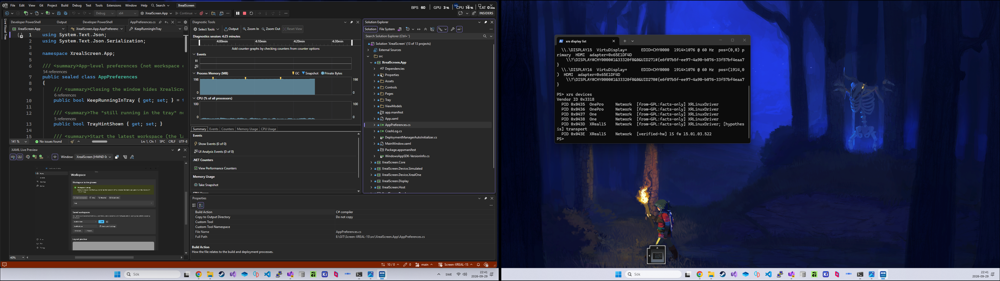
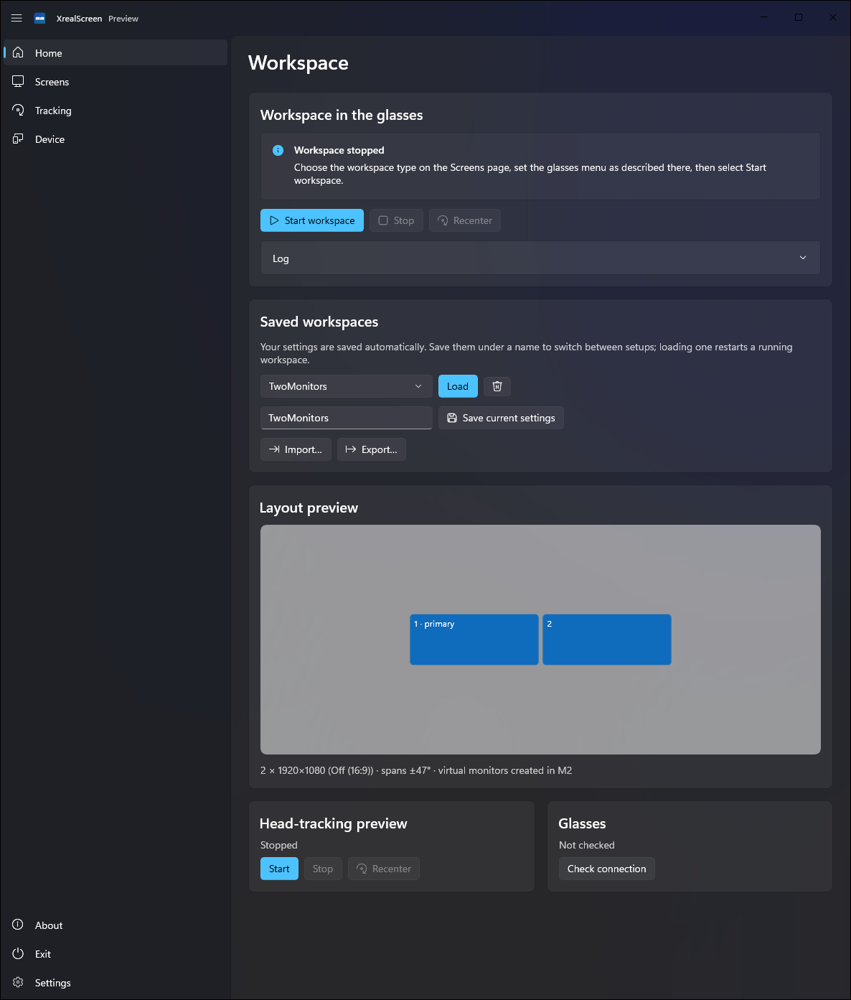
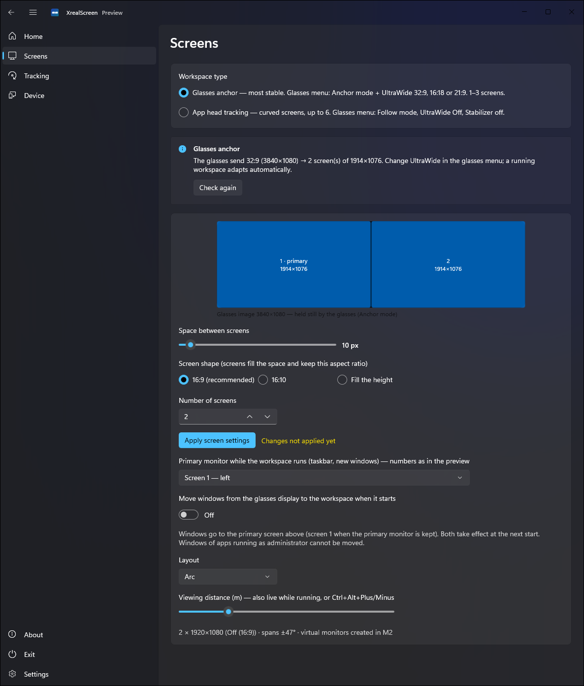
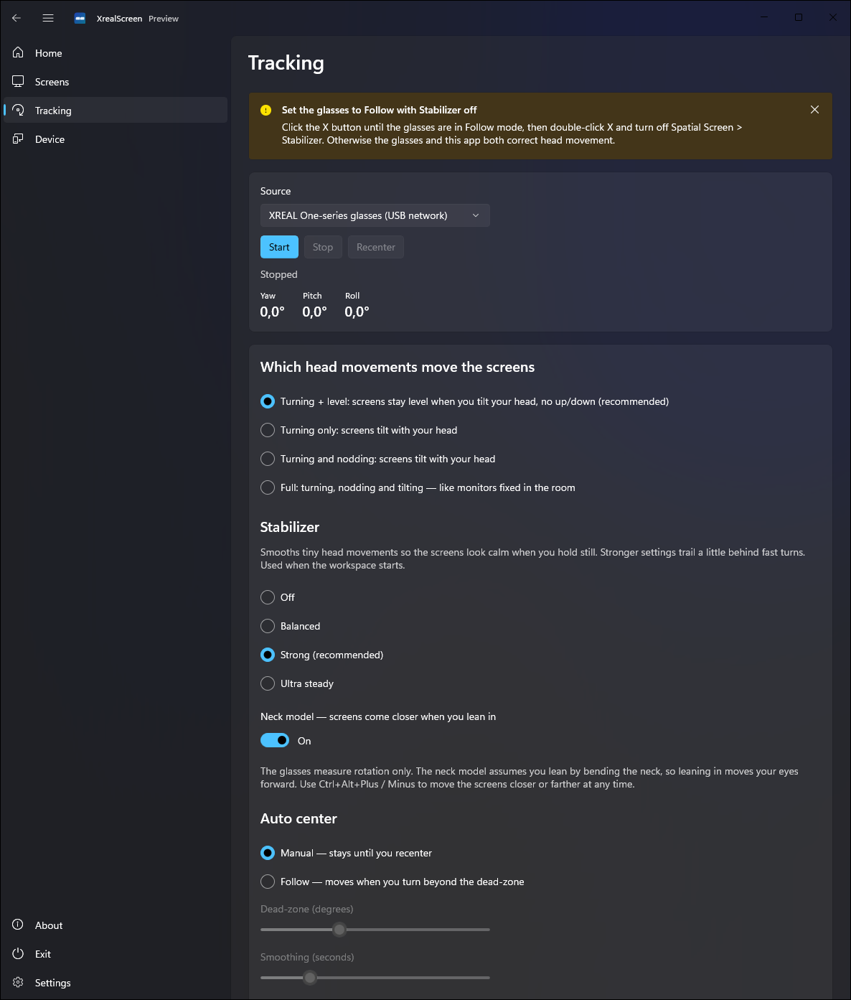
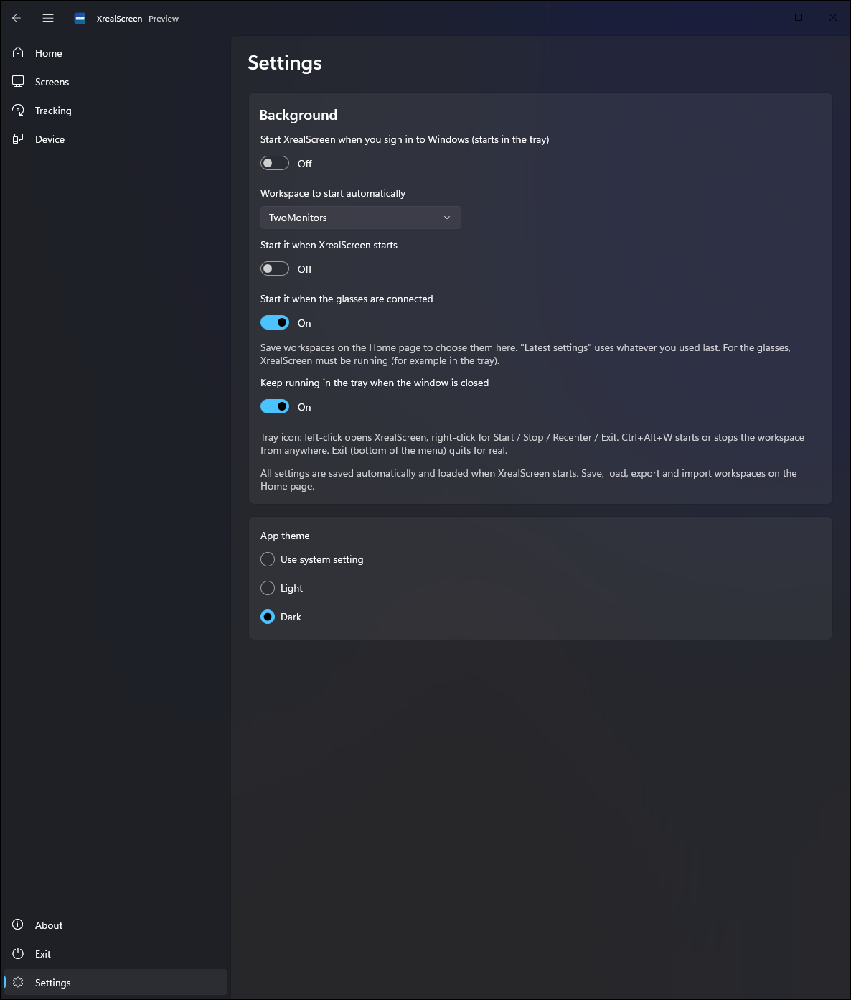

# XrealScreen (Screen-XREAL-1S)



*What the glasses show: a Glasses anchor workspace with two virtual screens (captured with the app's Screenshot function, Ctrl+Alt+P). Black areas are see-through in the glasses.*

A Windows 11 app that turns **XREAL 1S** (also One / One Pro) AR glasses into a virtual multi-monitor workspace.

## Features
- **Two workspace types**
  - **Glasses anchor** (most stable): the glasses hold their own UltraWide image still (OSD Anchor + UltraWide 32:9, 21:9 or 16:18); XrealScreen splits it into 1–3 pixel-exact virtual screens with an adjustable gap and shape.
  - **App head tracking**: up to 6 curved screens in an arc or grid, head-tracked by the app (stabilizer presets, tracking axes, neck model, auto center with dead-zone, adjustable distance).
- **Real virtual monitors**: Windows sees extra monitors, so you drag windows onto them as usual. Your monitor layout and refresh rates are always restored when the workspace stops, even after a crash.
- **Saved workspaces**: save, load, delete, **import and export** your setups. All settings are saved automatically and loaded at start.
- **Automatic start**: start a chosen workspace when XrealScreen starts and/or **when the glasses are connected**. A Glasses anchor workspace waits (with a message on the Home page and in the tray) until the glasses are in UltraWide mode, then starts by itself.
- **Primary monitor**: make any virtual screen the Windows primary monitor while the workspace runs; windows left on the glasses display are moved onto the workspace.
- **Screenshots of the glasses**: Home **Screenshot** button, tray menu or **Ctrl+Alt+P** save exactly what the glasses show to `Pictures\XrealScreen`.
- **Tray and hotkeys**: runs in the tray; Ctrl+Alt+W starts/stops the workspace, Ctrl+Alt+P takes a screenshot; start with Windows; **Exit** quits for real.
- Modern WinUI 3 UI (Fluent, Mica, light/dark), .NET 10.

> **Status: preview.** Both workspace types run end to end on the XREAL 1S; the installer (signed MSIX + virtual display driver) is being tested. See [docs/STATUS.md](docs/STATUS.md) and [docs/ROADMAP.md](docs/ROADMAP.md).

## Screenshots
| Home | Screens |
|------|---------|
|  |  |

| Tracking | Settings |
|----------|----------|
|  |  |

## Setting up the glasses
| Workspace type | Glasses menu |
|----------------|--------------|
| Glasses anchor | **Anchor** mode + **UltraWide 32:9, 21:9 or 16:18** |
| App head tracking | **Follow** mode, UltraWide **Off**, Stabilizer **off** |

Details: [docs/findings/xreal-1s-hardware.md](docs/findings/xreal-1s-hardware.md).

## How it works
The glasses connect over USB-C: video arrives as a normal Windows monitor, and head-tracking (IMU) data arrives over a USB network adapter. XrealScreen creates virtual monitors with an open-source Indirect Display Driver ([virtual-display-rs](https://github.com/MolotovCherry/virtual-display-rs)), captures them with Windows.Graphics.Capture and draws them on the glasses with Direct3D 11 — either split pixel-exact into the glasses' anchored UltraWide image, or head-tracked in 3D from the fused IMU pose. Details: [docs/ARCHITECTURE.md](docs/ARCHITECTURE.md).

The official XREAL SDK is Unity/Android-only, so it is not used at runtime ([docs/findings/xreal-sdk.md](docs/findings/xreal-sdk.md)).

## Install
See [installer/README.md](installer/README.md) (`installer\Build-Package.ps1` builds a signed self-contained MSIX with the driver and install scripts).

## Build
Requirements: Windows 11, .NET SDK 10.0.401+, Windows SDK 10.0.26100.
```powershell
dotnet build XrealScreen.slnx -p:Platform=x64
dotnet test --solution XrealScreen.slnx
dotnet build src/XrealScreen.App -p:Platform=x64
dotnet run --project src/XrealScreen.App -p:Platform=x64
```
The app is packaged (MSIX): run it from Visual Studio with the **XrealScreen.App (Package)** profile, `dotnet run`, or the Start menu — starting the .exe directly fails. Don't build the app project while it runs a workspace (Windows closes the app; `xrs recover` restores the monitors).

## Developer tool (`xrs`)
```powershell
dotnet run --project tools/XrealScreen.Cli -- --help
dotnet run --project tools/XrealScreen.Cli -- probe            # glasses connection and IMU stream
dotnet run --project tools/XrealScreen.Cli -- display list     # monitors, glasses and virtual screens
dotnet run --project tools/XrealScreen.Cli -- capture glasses  # screenshot of the glasses
dotnet run --project tools/XrealScreen.Cli -- recover          # clean up after a crashed session
```
Hardware test steps: [docs/testing/hardware-test-M1.md](docs/testing/hardware-test-M1.md).

## Contributing / AI agents
Start with [CLAUDE.md](CLAUDE.md) or [AGENTS.md](AGENTS.md).

## License
MIT — see [LICENSE](LICENSE) and [THIRD-PARTY-NOTICES.md](THIRD-PARTY-NOTICES.md). Not affiliated with or endorsed by XREAL.
