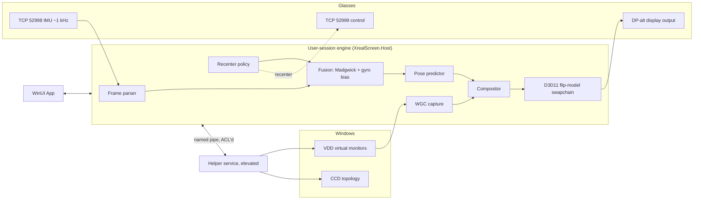

# Architecture

XrealScreen turns XREAL 1S (also One / One Pro) glasses into a head-tracked multi-monitor workspace on Windows.

## Physical interfaces
- **Video:** USB-C DisplayPort alt mode. Glasses appear as a normal Windows monitor (vendor spec; not yet [verified-hw]).
- **Data:** USB NCM network adapter. Glasses `169.254.2.1`, PC `169.254.2.10`. TCP 52998 IMU, 52999 control, 52996 metadata. [hypothesis for 1S] — see `findings/xreal-one-protocol.md`.

## Operating modes (ADR-0003)
| Mode | Who tracks the head | What we render | Glasses OSD anchor |
|------|--------------------|----------------|--------------------|
| **Native** | Glasses (X1 chip) | Nothing; Windows drives the glasses as a monitor. We set mode via CCD and send recenter/control. | On |
| **Virtual workspace** | Us (IMU → fusion) | N virtual monitors composited in 3D, fullscreen on the glasses output | **Off** (avoid double correction) |

## Components (projects)
Projects are created when their milestone starts (no empty shells).

| Project | Status | Responsibility |
|---------|--------|----------------|
| `src/XrealScreen.Core` | **exists** | Madgwick fusion (ADR-0007), gyro bias, `HeadTracker` + prediction, `AutoCenter` (`RecenterPolicy`), `UltrawideMode`, `WorkspaceLayout`, `GlassesCatalog`, `.xrimu` format, interfaces `IImuSource`, `IVirtualDisplayProvider` |
| `src/XrealScreen.Device.XrealOne` | **exists** | NCM adapter discovery, TCP IMU client, stream framer, axis mapping, raw `.xrcap` capture |
| `src/XrealScreen.Device.Simulated` | **exists** | Synthetic motion, `.xrimu` replay |
| `src/XrealScreen.App` | **exists** | WinUI 3 (packaged, Mica, NavigationView). Home: Start/Stop/Recenter workspace + log (`SessionViewModel` → `WorkspaceEngine`); Screens: count/ultrawide/layout; Tracking: stabilizer, auto center, preview; Device; Settings |
| `tools/XrealScreen.Cli` (`xrs`) | **exists** | `devices`, `probe`, `imu record/decode/live/replay/synth`. `imu record` is also the raw-traffic sniffer (`.xrcap`). |
| `src/XrealScreen.Display` | **exists** | CCD topology read (`CcdDisplayTopology`), EDID glasses detection (`GlassesDisplayLocator`), `VirtualDisplayRsProvider` (ADR-0008); topology snapshot/restore next |
| `src/XrealScreen.Render` | **exists** (capture done; render M3) | `GraphicsDevice`, `MonitorCapture` (WGC); next: D3D11 flip-model swapchain, compositor, late pose latch, stats |
| `src/XrealScreen.Host` | **exists** | `WorkspaceEngine` (one session: virtual monitors → desktop order → refresh sync → capture → tracking → presenter; always restores the desktop), `WorkspaceOptions`, `WorkspaceSettingsStore` (%LOCALAPPDATA%\XrealScreen\settings.json), `WorkspaceLibrary` (named workspaces in `workspaces\`, export/import bundle). Used by the app and `xrs render`. |
| `src/XrealScreen.Contracts` | M6 | IPC DTOs, named-pipe framing, System.Text.Json source-gen |
| `src/XrealScreen.Service` | M6 | Elevated helper Windows service (ADR-0004) |
| Packaging / bootstrapper | M7 | Single-project MSIX lives in the App today; bootstrapper installs VDD (ADR-0005) |

## Data flow (virtual workspace mode)

1. IMU frames (TCP) → parser → fusion → orientation quaternion.
2. Predictor extrapolates to expected photon time (now + render + scanout).
3. VDD monitors are captured by WGC into D3D11 textures (same adapter as glasses).
4. Compositor draws each monitor on a quad/curved surface rotated by the inverse head pose; pose latched as late as possible before present.
5. Swapchain presents fullscreen on the glasses output at native refresh (120 Hz).

## Threading model
| Thread | Work | Notes |
|--------|------|-------|
| IMU reader | Socket read + parse + fusion update | Dedicated, high priority; writes latest pose to a lock-free slot |
| Capture | WGC `FrameArrived` (free-threaded frame pool) | Keeps latest texture per monitor; never blocks |
| Render | Waitable swapchain loop: wait → latch pose → draw → present | Dedicated thread; MMCSS "Games" class |
| UI | WinUI dispatcher | Reads stats/state only via observable snapshots |
| Control | Async control/metadata requests | `async`/`await`, cancellation-aware |

No capture frames are persisted to disk (privacy).

## App vs service split (ADR-0004)
- **Engine runs in the user session** (inside the App process or a user-session host): capture, render, IMU, CCD all need the interactive desktop; Session 0 cannot access it.
- **Helper service** (elevated, small): virtual display driver presence/version check and install trigger (ADR-0008), topology-restore watchdog if the app dies.
- **IPC:** named pipe with ACL limited to the interactive user + SYSTEM; DTOs in `XrealScreen.Contracts`; versioned messages.

## Invariants
- Always restore the original display topology (on exit, crash watchdog, panic hotkey).
- Only manage virtual monitors we created (VDD may be shared with other apps).
- VDD monitors and glasses output must be on the same GPU adapter.
